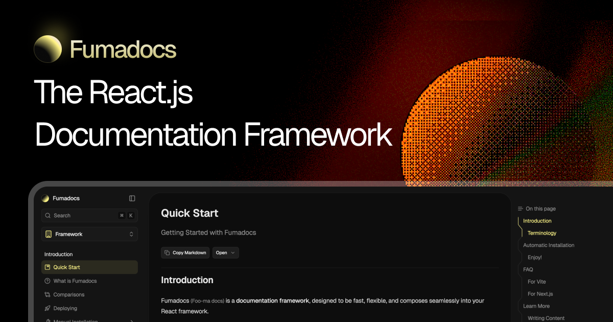

The library for building documentation websites in Next.js.

📘 Learn More: [Documentation](https://next-docs-zeta.vercel.app)

Next Docs Provides:

-   Search (Supported: flexsearch)
-   Breadcrumb, Sidebar, TOC Components
-   Additional utilities (getTOC, buildPageTree)

## Installation

```
npm install next-docs-zeta
```

## Getting Started

Next Docs is built for Next.js App Router and support any sources.

It's recommended to use Next Docs with [Tailwind CSS](https://tailwindcss.com) + [Radix UI](https://www.radix-ui.com), and [Contentlayer](https://www.contentlayer.dev) (or any CMS).

### Example

[](https://githubbox.com/SonMooSans/next-docs-template)

View the [Template](https://github.com/SonMooSans/next-docs-template) repository on Github.

### Sources

Next Docs has native support for [Contentlayer](https://www.contentlayer.dev).

### Learn More

**Next Docs** offers simple document searching as well as components for building a good docs. You can go to our [website](https://next-docs-zeta.vercel.app/docs) to learn more about this.
