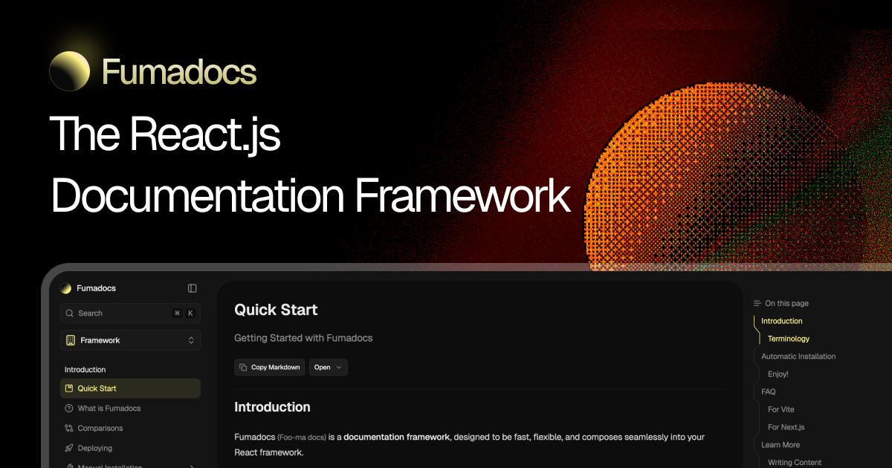

The framework for building documentation websites in React.js frameworks and Astro.

**Officially Supported:**

- Next.js
- Astro (with React)
- Vite: Tanstack Start, Waku, React Router

📘 Learn More: [Documentation](https://fumadocs.dev).

## Compatibility

All packages are **ESM only**.

## Sticker

Welcome to print it out :D

## Contributions

Make sure to read the [Contributing Guide](/.github/contributing.md) before submitting a pull request.
