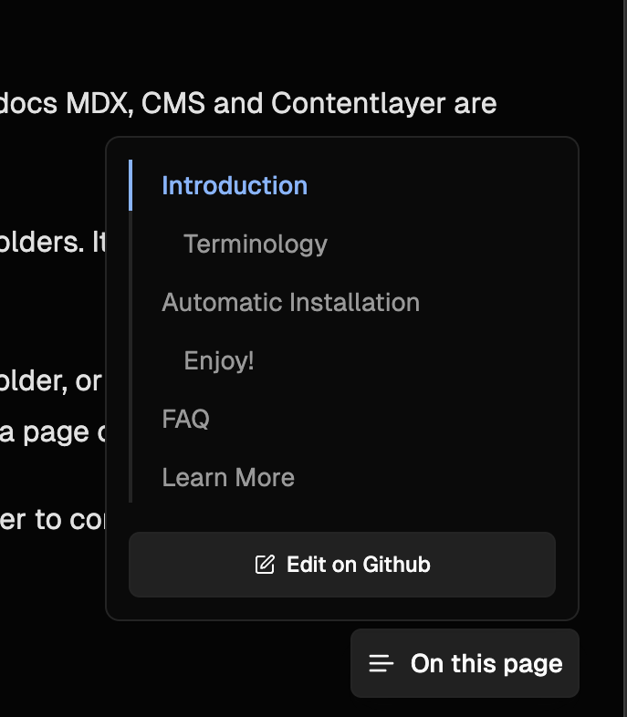

## Some Improvements

After releasing Fumadocs 12, some improvements are made to the new UI.

### TOC Popover

Previously, this was only available on larger devices. Now, it's collapsed to a popover on smaller devices.

### Links Menu

To make the sidebar looks even better, we moved navigation links to the links menu (the three-dots button at the top corner).

The recommended design is:

- Docs related links: Use `<RootToggle />` or include it in page trees.
- Other links: Use the Links API of docs layout.

### Breadcrumbs

Removed the duplicated page name from breadcrumbs, now it only shows the folder names.
Also, you can enable `includeSeparators` to show separators on your breadcrumbs component.

The new breadcrumbs look cleaner and match the design even better.

## Adaption

Some docs sites such as https://yeecord.com and https://turbo.build adapted the new UI, I'm very excited about it.
Removing the navbar seemed to be a very risky move to me, almost no documentation framework had made it, and I was expecting some complaints about the new design.

Luckily, most people are satisfied about the new UI.
The new design was originally inspired by Arc, their sidebar looked very impressive to me.
Although I soon discovered the docs site of Linear also doesn't have a navbar, Arc is still the first inspiration of the redesign.

I'm grateful that many people gave me their feedback about the new design, so that I can keep making Fumadocs a better framework to use.
Let's make a better docs.
