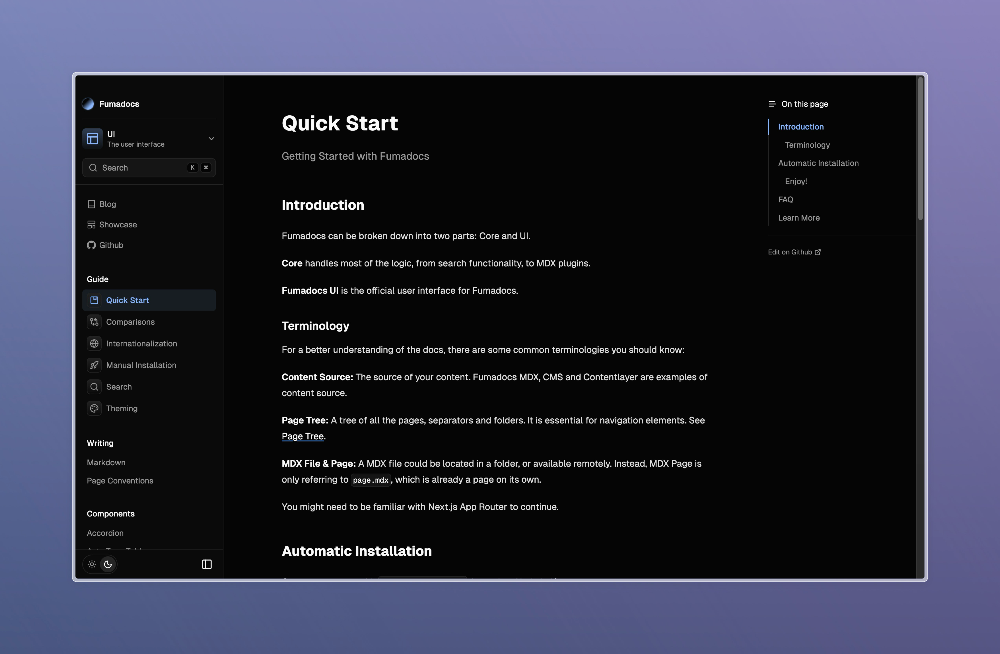

## What's New?

Fumadocs v12 mainly aims to improve the UI, prioritizing content and reading experience.

### New UI

After observing large docs sites like https://turbo.bulid, I found the navbar took too much space on the screen, while it only contains links to Blog, Showcase, GitHub, etc.
They are not necessarily related to the docs, placing them at the top of our screen doesn't bring a better reading experience.

All these links are now moved to sidebar, allowing a clean, minimal view of docs.



I also noticed the docs start to look messy as your content grows. To ameliorate this, the sidebar now includes a border and background by default.
This helps readers to distinguish navigation elements and content easier.

The sidebar will always be placed at the left of screen, having a bigger space on large viewports.

I believe the new UI still has room for improvement. Welcome to report UI issues, or leave a feedback!

### Better Multi Page Trees

We supported multiple page trees at a very early version of Fumadocs. However, it lacks of proper explanations and guides to configure it.
In the past, you need to implement a navigation element to switch between page trees. And mark the folder as a root folder.

Now, you can use the `<RootToggle />` component directly, and docs has a better explanation of it.

<div className="flex flex-row justify-center mx-auto max-w-[300px]">
  
</div>

### Page Tree Post Processors

You can now attach properties to page trees easily with the Source API.

```ts
import { loader } from 'fumadocs-core/source';

export const utils = loader({
  pageTree: {
    attachFile(node) {
      // modify the node
      return node;
    },
  },
});
```

### Improved I18n Support

The language switch is now added to Docs Layout.

```tsx
import { DocsLayout } from 'fumadocs-ui/layout';

export default function Layout({ children }: { children: React.ReactNode }) {
  return <DocsLayout i18n>{children}</DocsLayout>;
}
```

Note that `<LanguageSelect />` component is now replaced by `<LanguageToggle />`, make sure to remove references to the old component.

## Breaking

### UI

Remove deprecated option `enableThemeProvider` from Root Provider. Use `theme.enabled` instead.

### Core

Remove deprecated option `minWidth` from Sidebar component. Use `blockScrollingWidth` instead

## Fixes

### UI

- Fix problems with twoslash codeblocks
- Apply typography styles to headings
- Support translation for theme label

### OpenAPI

- Fix nullable types cannot be detected

### Core

- Remark Headings: Support code syntax in headings

### Create Fumadocs App

- Add `layout.config.tsx` file for sharing layout options
