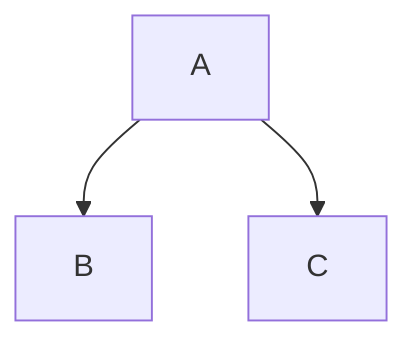

## Setup

Fumadocs doesn't have a built-in Mermaid wrapper provided, we recommend using `mermaid` directly.

You can decide the Mermaid renderer to configure:

### Official Renderer

Install the required dependencies, `next-themes` is used with Fumadocs to manage the light/dark mode.

```npm
npm install mermaid next-themes
```

Create the Mermaid component:

<include cwd meta='title="components/mdx/mermaid.tsx"'>
  ./components/mdx/mermaid.tsx
</include>

### Beautiful Mermaid

[`beautiful-mermaid`](https://github.com/lukilabs/beautiful-mermaid) is a 3rd party Mermaid renderer.

```npm
npm install beautiful-mermaid
```

```tsx title="components/mdx/mermaid.tsx"
import { CodeBlock, Pre } from 'fumadocs-ui/components/codeblock';
import { renderMermaidSVG } from 'beautiful-mermaid';

export async function Mermaid({ chart }: { chart: string }) {
  try {
    const svg = renderMermaidSVG(chart, {
      bg: 'var(--color-fd-background)',
      fg: 'var(--color-fd-foreground)',
      interactive: true,
      transparent: true,
    });

    return <div dangerouslySetInnerHTML={{ __html: svg }} />;
  } catch {
    return (
      <CodeBlock title="Mermaid">
        <Pre>{chart}</Pre>
      </CodeBlock>
    );
  }
}
```

## Usage

Add the component as a MDX component:

```tsx title="components/mdx.tsx"
import defaultMdxComponents from 'fumadocs-ui/mdx';
import { Mermaid } from '@/components/mdx/mermaid'; // [!code ++]
import type { MDXComponents } from 'mdx/types';

export function getMDXComponents(components?: MDXComponents) {
  return {
    ...defaultMdxComponents,
    Mermaid, // [!code ++]
    ...components,
  } satisfies MDXComponents;
}
```

Then, use it in MDX files.

```mdx
<Mermaid
  chart="
graph TD;
subgraph AA [Consumers]
A[Mobile app];
B[Web app];
C[Node.js client];
end
subgraph BB [Services]
E[REST API];
F[GraphQL API];
G[SOAP API];
end
Z[GraphQL API];
A --> Z;
B --> Z;
C --> Z;
Z --> E;
Z --> F;
Z --> G;"
/>
```

<Tabs items={['Diagram', 'User Journey']}>

    <Tab>
    <Mermaid
        chart="

graph TD;
subgraph AA [Consumers]
A[Mobile app];
B[Web app];
C[Node.js client];
end
subgraph BB [Services]
E[REST API];
F[GraphQL API];
G[SOAP API];
end
Z[GraphQL API];
A --> Z;
B --> Z;
C --> Z;
Z --> E;
Z --> F;
Z --> G;"
/>

</Tab>

    <Tab>
        <Mermaid
            chart="

journey
title My working day
section Go to work
Make tea: 5: Me
Go upstairs: 3: Me
Do work: 1: Me, Cat
section Go home
Go downstairs: 5: Me
Sit down: 5: Me
"
/>

    </Tab>

</Tabs>

### As CodeBlock

You can convert `mermaid` codeblocks into the MDX usage with the `remarkMdxMermaid` remark plugin.

```tsx tab="Fumadocs MDX" title="source.config.ts"
import { remarkMdxMermaid } from 'fumadocs-core/mdx-plugins';
import { defineConfig } from 'fumadocs-mdx/config';

export default defineConfig({
  mdxOptions: {
    remarkPlugins: [remarkMdxMermaid],
  },
});
```

````md

````
