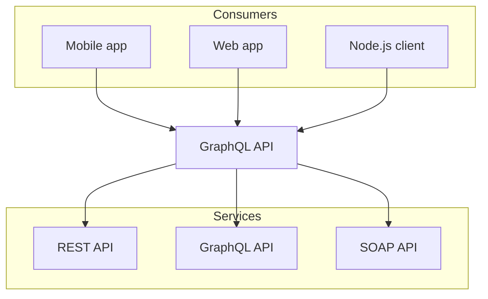

Fumadocs doesn't have a built-in Mermaid wrapper provided, instead you can try different approaches easily.

## Setup

`@theguild/remark-mermaid` converts codeblocks to JSX elements using MDX and render them in a React component. It renders the graph on client side.

```package-install
@theguild/remark-mermaid
```

Add their remark plugin, for example (in Fumadocs MDX):

```ts title="source.config.ts"
import { defineDocs, defineConfig } from 'fumadocs-mdx/config';
import { remarkMermaid } from '@theguild/remark-mermaid';

export const { docs, meta } = defineDocs({
  dir: 'content/docs',
});

export default defineConfig({
  mdxOptions: {
    remarkPlugins: [remarkMermaid],
  },
});
```

````md

````

<Mermaid
  chart="
graph TD;
subgraph AA [Consumers]
A[Mobile app];
B[Web app];
C[Node.js client];
end
subgraph BB [Services]
E[REST API];
F[GraphQL API];
G[SOAP API];
end
Z[GraphQL API];
A --> Z;
B --> Z;
C --> Z;
Z --> E;
Z --> F;
Z --> G;"
/>
