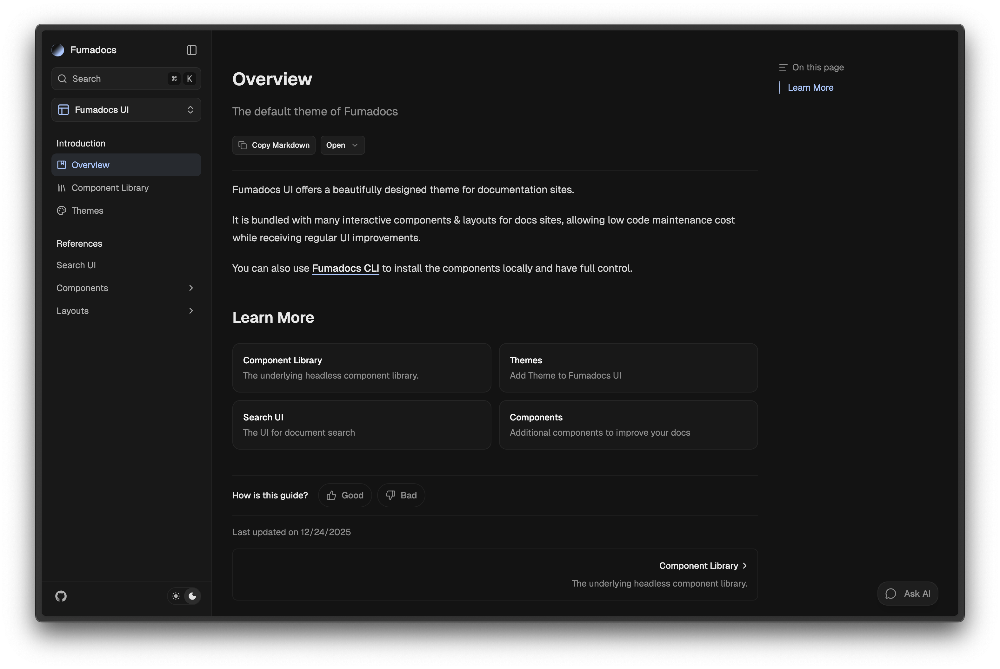

The layout of documentation pages, it includes a sidebar and **mobile-only** navbar/header.



<Customisation />

## Usage

Pass your page tree to the component.

```tsx title="layout.tsx"
import { DocsLayout } from 'fumadocs-ui/layouts/docs';
import { baseOptions } from '@/lib/layout.shared';
import type { ReactNode } from 'react';

export default function Layout({ children }: { children: ReactNode }) {
  return (
    <DocsLayout {...baseOptions()} tree={tree}>
      {children}
    </DocsLayout>
  );
}
```

See detailed docs for [`links`](/docs/ui/layouts/links) and [`nav`](/docs/ui/layouts/nav) options.

### References

<auto-type-table
  cwd path="content/docs/ui/props.ts"
  type="Omit<DocsLayoutProps, 'children' | 'disableThemeSwitch'>"
/>

## Sidebar

```tsx title="layout.tsx"
import { DocsLayout } from 'fumadocs-ui/layouts/docs';

<DocsLayout
  sidebar={{
    enabled: true,
  }}
/>;
```

### Sidebar Items

Customise sidebar navigation links.

<div className='flex justify-center items-center *:max-w-[200px] bg-gradient-to-br from-fd-primary/10 rounded-xl border'>

    

</div>

Sidebar items are rendered from the page tree you passed to `<DocsLayout />`.

For page tree from [`loader()`](/docs/headless/source-api), it generates the tree from your file structure, see [available patterns](/docs/page-conventions).

```tsx title="layout.tsx"
import { DocsLayout } from 'fumadocs-ui/layouts/docs';
import { source } from '@/lib/source';
import type { ReactNode } from 'react';

export default function Layout({ children }: { children: ReactNode }) {
  return (
    <DocsLayout
      tree={source.getPageTree()}
      // other props
    >
      {children}
    </DocsLayout>
  );
}
```

You may hardcode it too:

```tsx title="layout.tsx"
import { DocsLayout } from 'fumadocs-ui/layouts/docs';
import type { ReactNode } from 'react';

export default function Layout({ children }: { children: ReactNode }) {
  return (
    <DocsLayout
      tree={{
        name: 'docs',
        children: [],
      }}
      // other props
    >
      {children}
    </DocsLayout>
  );
}
```

### Sidebar Tabs (Dropdown) [#sidebar-tabs]

Sidebar Tabs are folders with tab-like behaviours, only the content of opened tab will be visible.

<div className='flex justify-center items-center *:max-w-[360px] bg-linear-to-br from-fd-primary/10 rounded-xl border'>

    

</div>

By default, the tab trigger will be displayed as a **Dropdown** component (hidden unless one of its items is active).

You can add items by marking folders as [Root Folders](/docs/page-conventions#root-folder), create a `meta.json` file in the folder:

```json title="content/docs/my-folder/meta.json"
{
  "title": "Name of Folder",
  "description": "The description of root folder (optional)",
  "root": true
}
```

Or specify them explicitly:

```tsx title="/app/docs/layout.tsx"
import { DocsLayout } from 'fumadocs-ui/layouts/docs';

<DocsLayout
  sidebar={{
    tabs: [
      {
        title: 'Components',
        description: 'Hello World!',
        // active for `/docs/components` and sub routes like `/docs/components/button`
        url: '/docs/components',

        // optionally, you can specify a set of urls which activates the item
        // urls: new Set(['/docs/test', '/docs/components']),
      },
    ],
  }}
/>;
```

Set it to `false` to disable:

```tsx
import { DocsLayout } from 'fumadocs-ui/layouts/docs';

<DocsLayout sidebar={{ tabs: false }} />;
```

<Callout title="Want further customisations?">

You can specify a `banner` to the [Docs Layout](/docs/ui/layouts/docs) component.

```tsx
import { DocsLayout, type DocsLayoutProps } from 'fumadocs-ui/layouts/docs';
import type { ReactNode } from 'react';
import { baseOptions } from '@/lib/layout.shared';
import { source } from '@/lib/source';

export default function Layout({ children }: { children: ReactNode }) {
  return (
    <DocsLayout
      {...baseOptions()}
      tree={source.getPageTree()}
      sidebar={{
        // [!code ++]
        banner: <div>Hello World</div>,
      }}
    >
      {children}
    </DocsLayout>
  );
}
```

</Callout>

#### Decoration

Change the icon/styles of tabs.

```tsx
import { DocsLayout } from 'fumadocs-ui/layouts/docs';

<DocsLayout
  sidebar={{
    tabs: {
      transform: (option, node) => ({
        ...option,
        icon: <MyIcon />,
      }),
    },
  }}
/>;
```

### Sidebar Components

You can replace certain components for rendering page tree.

```tsx tab="layout.tsx"
import { DocsLayout } from 'fumadocs-ui/layouts/docs';
import { SidebarSeparator } from './layout.client';

<DocsLayout
  sidebar={{
    enabled: true,
    components: {
      Separator: SidebarSeparator,
    },
  }}
/>;
```

```tsx tab="layout.client.tsx"
'use client';
import * as Base from 'fumadocs-ui/components/sidebar/base';

export function SidebarSeparator({ className, style, children, ...props }: ComponentProps<'p'>) {
  const depth = Base.useFolderDepth();

  return (
    <Base.SidebarSeparator
      className={cn('[&_svg]:size-4 [&_svg]:shrink-0', className)}
      style={{
        paddingInlineStart: `calc(${2 + 3 * depth} * var(--spacing))`,
        ...style,
      }}
      {...props}
    >
      {children}
    </Base.SidebarSeparator>
  );
}
```

### References

<auto-type-table cwd path="content/docs/ui/props.ts" name="SidebarProps" />

## Advanced

### Prefetching

Fumadocs use the `<Link />` component of your React framework, and keep their default prefetch behaviours.

On Vercel, prefetch requests may cause a higher usage of serverless functions and Data Cache.
It can also hit the limits of some other hosting platforms.

You can disable prefetching to reduce the amount of prefetch requests, or enable explicitly:

```tsx
import { DocsLayout } from 'fumadocs-ui/layouts/docs';

<DocsLayout sidebar={{ prefetch: false }} />;
```

### The Layout System

Handling layout is challenging, Fumadocs UI needed an approach that is:

- **Composable:** Layout components should manage their position and size effortlessly, ideally in place.
- **Flexible:** The system should avoid reliance on fixed values or heights, enabling seamless integration of external components, such as AI chat interfaces.
- **Cohesive:** Components should respond to changes in others, for instance, by animating sidebar collapses.
- **Predictable:** Layout properties should remain centralized, allowing the final result to be readily anticipated from the source code.
- **Compatible:** The solution should work on older browsers by leveraging only Baseline Widly Available CSS features.

Fumadocs UI does this with a grid system:

```css
#nd-docs-layout {
  grid-template:
    'sidebar header toc'
    'sidebar toc-popover toc'
    'sidebar main toc' 1fr / minmax(var(--fd-sidebar-col), 1fr) minmax(0, var(--fd-page-col))
    minmax(min-content, 1fr);

  --fd-docs-row-1: var(--fd-banner-height, 0px);
  --fd-docs-row-2: calc(var(--fd-docs-row-1) + var(--fd-header-height));
  --fd-docs-row-3: calc(var(--fd-docs-row-2) + var(--fd-toc-popover-height));
  --fd-sidebar-col: var(--fd-sidebar-width);
  --fd-page-col: calc(
    var(--fd-layout-width, 97rem) - var(--fd-sidebar-width) - var(--fd-toc-width)
  );
  --fd-sidebar-width: 0px;
  --fd-toc-width: 0px;

  --fd-header-height: 0px;
  --fd-toc-popover-height: 0px;
}
```

- The layout container uses grid layout, `grid-template` is set to produce predictable result.
- `--fd-docs-row-*` define the top offset of each row, allowing elements with `position: sticky` to hook a correct top offset.
- `--fd-*-width` and `--fd-*-height` are set by layout components using CSS, they are essential to maintain the grid structure, or calculating `--fd-docs-row-*`.
- `--fd-*-col` are dynamic values, updated as state changes (e.g. `--fd-sidebar-col` becomes `0px` when the sidebar is collapsed).

Both default and the notebook layout utilize this system.
