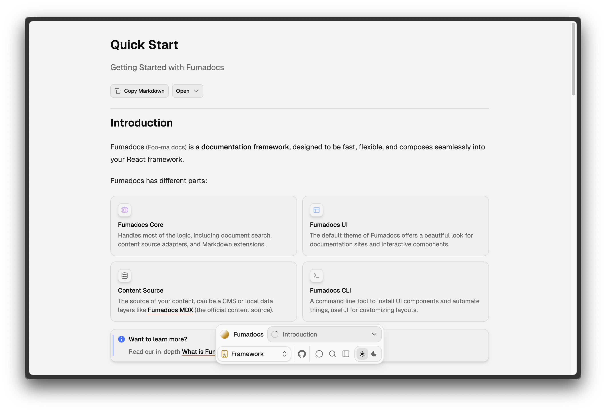

A docs layout that impractically minimal & clean, originally made for experimental purpose.



<Customisation />

## Usage

Enable the Flux layout with `fumadocs-ui/layouts/flux`.

```tsx title="layout.tsx"
import { DocsLayout } from 'fumadocs-ui/layouts/flux'; // [!code highlight]
import { baseOptions } from '@/lib/layout.shared';
import { source } from '@/lib/source';
import type { ReactNode } from 'react';

export default function Layout({ children }: { children: ReactNode }) {
  return (
    <DocsLayout {...baseOptions()} tree={source.getPageTree()}>
      {children}
    </DocsLayout>
  );
}
```

Make sure to update your page import too:

```tsx title="page.tsx"
import { ... } from 'fumadocs-ui/layouts/docs/page'; // [!code --]
import { ... } from 'fumadocs-ui/layouts/flux/page'; // [!code ++]
```

<Callout title="Important to know">

- It is best to be paired with [static/local search](/docs/search/orama#static), the navigation is more efficient using document search.
- It prioritizes subjective aesthetics over user experience.
- It is opinionated, use Fumadocs CLI for customisation instead.

</Callout>

## Configurations

The options are inherited from [Docs Layout](/docs/ui/layouts/docs), with minor differences:

- Flux layout is a client component, you cannot pass unserializable props from a server component.
- A `renderNavigationPanel` prop to customise the bottom navigation panel.
- There is no `tocPopover` options.
