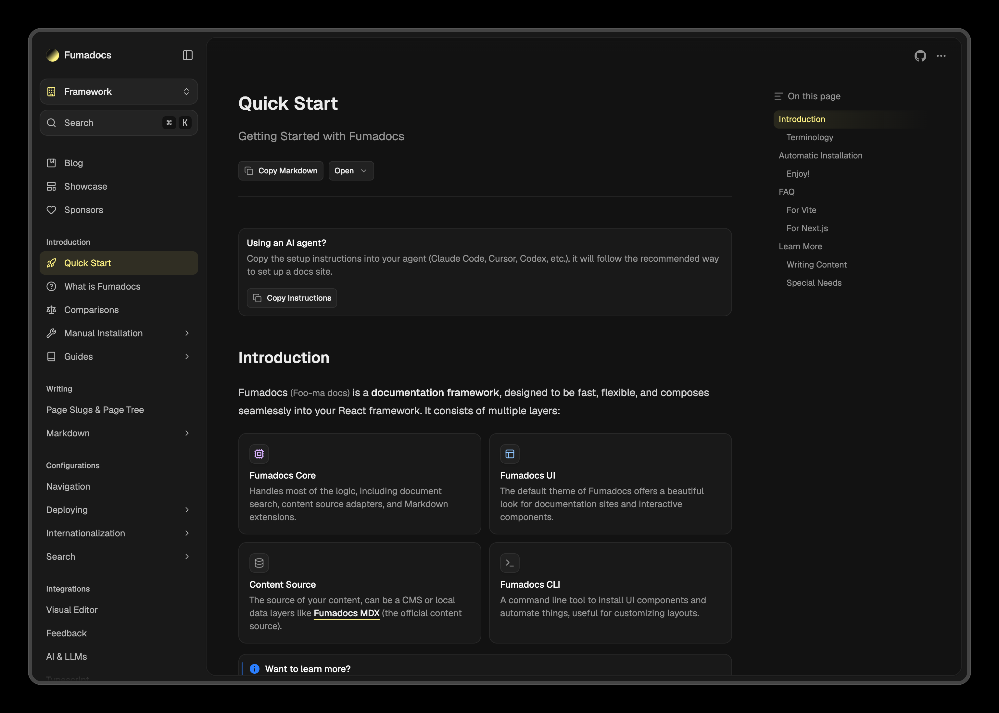

A less compact version of [`<DocsLayout />`](/docs/ui/layouts/docs), the page sits in an inset panel beside the sidebar, with page-level actions at the top of the panel.



<Callout title="Base UI only">

Spacious layout is only available in the Base UI version of Fumadocs UI (`@fumadocs/base-ui`).

</Callout>

<Customization />

## Usage

Enable the Spacious layout with `fumadocs-ui/layouts/spacious`.

```tsx title="layout.tsx"
import { DocsLayout } from 'fumadocs-ui/layouts/spacious'; // [!code highlight]
import { baseOptions } from '@/lib/layout.shared';
import { source } from '@/lib/source';
import type { ReactNode } from 'react';

export default function Layout({ children }: { children: ReactNode }) {
  return (
    <DocsLayout {...baseOptions()} tree={source.getPageTree()}>
      {children}
    </DocsLayout>
  );
}
```

Make sure to update your page import too:

```tsx title="page.tsx"
import { ... } from 'fumadocs-ui/layouts/docs/page'; // [!code --]
import { ... } from 'fumadocs-ui/layouts/spacious/page'; // [!code ++]
```

### Styles

Like Glass layout, Spacious layout styles are **not** bundled into the CSS preset, so you don't pay for them unless you use the layout. Import them in your Tailwind CSS file:

```css title="Tailwind CSS"
@import 'tailwindcss';
/* [!code ++] */
@import 'fumadocs-ui/css/generated/spacious.css';
@import 'fumadocs-ui/css/neutral.css';
@import 'fumadocs-ui/css/preset.css';
```

<Callout title="Important to know">

- Spacious layout is a **client component**, you cannot pass unserializable props from a server component.
- On desktop, the page scrolls inside the panel instead of the window.

</Callout>

## Configurations

The options are inherited from [Docs Layout](/docs/ui/layouts/docs), with minor differences:

- the `sidebar` option only accepts `defaultOpenLevel` and `prefetch`, the sidebar is always collapsible.
- additional options (see below).

### Layout Tabs

Configure [Layout Tabs](/docs/ui/layouts/docs#layout-tabs) with the `tabs` prop, see the linked docs for how to add them. Tabs are shown as a dropdown at the top of sidebar.

```tsx title="layout.tsx"
import { DocsLayout } from 'fumadocs-ui/layouts/spacious';
import { baseOptions } from '@/lib/layout.shared';
import { source } from '@/lib/source';
import type { ReactNode } from 'react';

export default function Layout({ children }: { children: ReactNode }) {
  return (
    <DocsLayout
      {...baseOptions()}
      tabs={
        {
          // customize tabs
        }
      }
      tree={source.getPageTree()}
    >
      {children}
    </DocsLayout>
  );
}
```

### AI Chat

Pass an `aiChat` object with the open state and a change handler to show **Ask AI** in the page options menu and the mobile sidebar.

With the `panel` option, the layout renders your chat panel for you: it's docked beside the page on wide screens (the table of contents moves into the page header), and floats over the page on smaller screens.

```tsx title="layout.tsx"
'use client';
import { DocsLayout } from 'fumadocs-ui/layouts/spacious';
import { useState } from 'react';

export function Layout({ children }) {
  const [open, setOpen] = useState(false);

  return (
    <DocsLayout
      // [!code ++:5]
      aiChat={{
        open,
        onOpenChange: setOpen,
        panel: <MyChat />,
      }}
      // ...
    >
      {children}
    </DocsLayout>
  );
}
```

### Slots

Spacious layout exposes a `slots` option to override its parts, in addition to the shared slots (`navTitle`, `themeSwitch`, `searchTrigger`, `languageSelect`).

| Slot      | Description                                                                        |
| --------- | ---------------------------------------------------------------------------------- |
| `header`  | The navbar on mobile.                                                              |
| `sidebar` | The sidebar system: `provider`, `main` (desktop) and `drawer` (mobile).            |
| `actions` | The actions at the top right of page, like the language switcher and options menu. |

```tsx title="layout.tsx"
import { DocsLayout } from 'fumadocs-ui/layouts/spacious';

<DocsLayout
  slots={{
    actions: MyActions, // [!code ++]
  }}
  // ...
/>;
```

## Docs Page

The page component is similar to [Docs Page](/docs/ui/layouts/page), with a few differences:

- The table of contents uses the `block` style by default.
- `tableOfContentPopover` configures the table of contents dropdown in page header, and the table of contents bar on mobile.
- `slots.toc` accepts a `dropdown` component for the dropdown in page header.
- There is no `container` slot.
