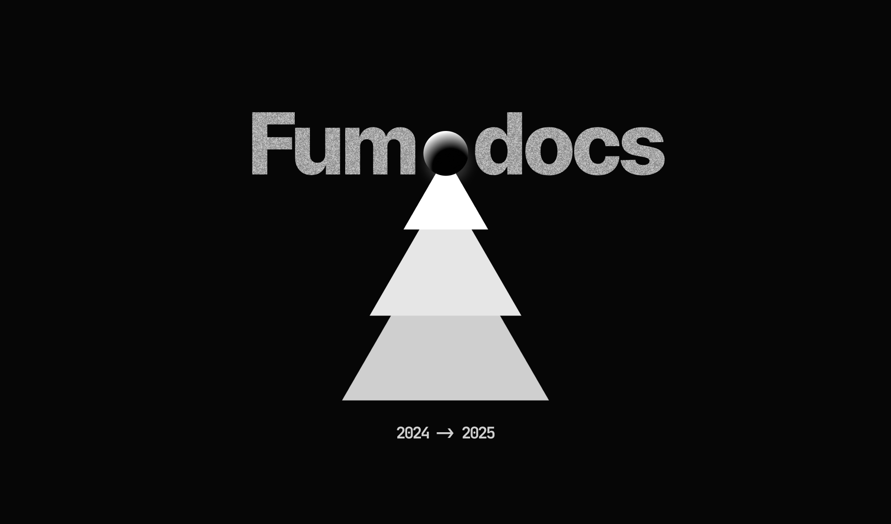

This is your new _vault_.

Make a note of something, [[create a link]], or try [the Importer](https://help.obsidian.md/Plugins/Importer)!

<Card href="/docs/headless">Hello World</Card>

When you're ready, delete this note and make the vault your own. ^123d4
![[Xmas.png]]

traditional Markdown images:



## Introduction!!

## Introduction!!

## Introduction!!

## Introduction!!

> [!warning] Hello World [[hello world]] **hello**
> I love Fumadocs.

[[#Introduction!!]]

[Alt](hello%20world.md)

%% Comment **hidden** %%

%% Comment

**hidden**

```ts
console.log('Hello World');
```

CodeBlock %%

Nothing
